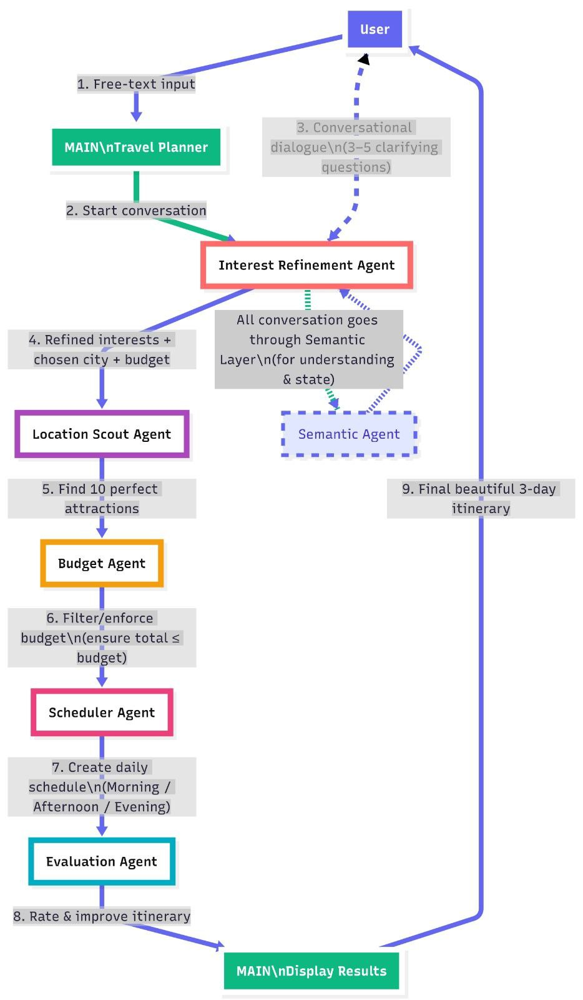
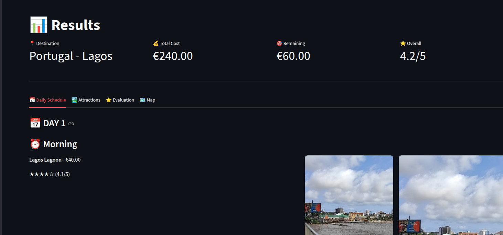

# Travel Iternary Planner

A Python-based travel itinerary generator that runs **fully offline** using a **local LLM powered by Ollama**. The application generates customized travel plans based on user input without relying on external APIs.

---

## Overview

This project demonstrates how to integrate a locally hosted Large Language Model (LLM) using **Ollama** with a Python application. The system prompts the model to generate a detailed travel itinerary, making it suitable for privacy-focused or offline-first use cases.

Key highlights:
- Runs entirely on your local machine
- No internet or paid API required
- Simple Python interface
- Easy to extend for other use cases (chatbots, planners, assistants)

---

## System Architecture

The application consists of a Python script that communicates with a locally running Ollama service, which hosts the selected LLM model.



**Architecture Flow:**
1. User executes the Python application
2. Python sends a prompt request to the Ollama API (local)
3. Ollama runs the selected LLM model (e.g., `llama3`)
4. The generated itinerary is returned to the Python app
5. Output is displayed in the terminal

---

## Prerequisites

Ensure the following are installed on your system:

- **Python 3.9+**
- **Ollama** (https://ollama.com)
- A supported LLM model (e.g., `llama3`)

---

## Installation

### 1. Clone the repository

```bash
git clone <repository-url>
cd <project-directory>
```

### 2. Create and activate a virtual environment

```bash
python -m venv venv
source venv/bin/activate   # macOS/Linux
venv\Scripts\activate      # Windows
```

### 3. Install dependencies

```bash
pip install -r requirements.txt
```

### 4. Install and prepare Ollama

Verify Ollama installation:

```bash
ollama --version
```

Pull the required model:

```bash
ollama pull llama3
```

---

## Usage

Start the Ollama service (if not already running):

```bash
ollama serve
```

Run the application:

```bash
python main.py
```

Follow the prompts to generate a personalized travel itinerary.

---

## Example Output



---

## Project Structure

```text
project/
├── agents/
├── pages/
├── ui/
├── utils/
├── logs/
├── tests/
├── app.py
├── config.py
├── main.py
├── Readme.md
└── image.jpg
```

---

## Troubleshooting

### Ollama command not found
- Confirm Ollama is installed and available in your PATH:
  ```bash
  ollama --version
  ```
- Restart your terminal or reinstall Ollama if necessary.

### Ollama server not running
- Start the service manually:
  ```bash
  ollama serve
  ```
- Keep it running while executing the Python script.

### Model not found or pull errors
- Pull the model explicitly:
  ```bash
  ollama pull llama3
  ```
- Check available models:
  ```bash
  ollama list
  ```

### Dependencies installation issues
- Ensure your virtual environment is activated.
- Reinstall dependencies:
  ```bash
  pip install -r requirements.txt
  ```

### Python version issues
- Verify Python version:
  ```bash
  python --version
  ```
- Upgrade if below 3.9.

### Poor or empty responses
- Test Ollama directly:
  ```bash
  ollama run llama3
  ```
- Try switching to another supported model.

---

## Future Improvements

- Add a web UI (FastAPI / Streamlit)
- Support multiple prompt templates
- Save itineraries to file (PDF/Markdown)
- Add logging and error handling

---

## License

This project is licensed under the MIT License.
